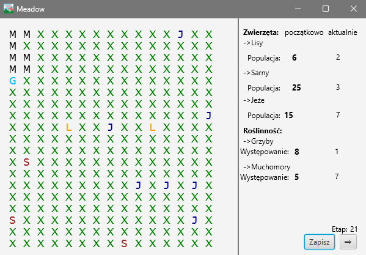
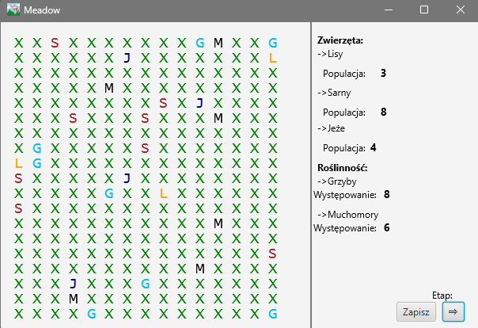

# Meadow
Język: Java

Łąka

Program służy do symulowania życia zwierząt na łące oraz występującej na niej roślinności. Tworzona jest plansza o określonej wielkości, a następnie losowo są dodawane obiekty na planszę. Możliwa jest opcja manipulowania wartościami pewnych zmiennych. Ostatecznie, program pozwala na obserwowanie życia na łące w czasie rzeczywistym i interakcje z planszą. Każdy obiekt posiada odmienne własności i wzorce zachowań.  Zwierzęta mogą poruszać się (w sposób losowy) po planszy o zadanych wymiarach. Każde z pól planszy może kryć jakiegoś rodzaju zasób (Roślinność). Symulację rozpoczynamy od utworzenia losowej planszy z zasobami o zadanych wymiarach. Następnie rozmieszczamy na niej losowo wygenerowane Zwierzęta. W każdym z kroków symulacji organizm przemieszcza się o specyficzną dla niego liczbę pól. W trakcie swojej wędrówki może znajdować zasoby, spotykać inne organizmy oraz wchodzić z nimi w interakcje. 

1. Klasa „Zwierzę” - zawiera takie atrybuty:  
1.1. nazwę zwierzęcia (nazwa),  
1.2. symbol, który reprezentuje zwierzę na planszy (symbol), 
1.3. wartość życia, która określa, jak wiele punktów życia ma dany obiekt (życie) 
 
2. Klasa „Mięsożerca” – klasa ta dziedziczy po klasie „Zwierzę” 
2.1.  zawiera takie dodatkowe pole jak ilość zadawanych obrażeń (obrażenia). 
2.2. Ilość ofiar (ofiary) 
2.3. Głód (Głód); 
 
3. Klasa „Roślinożerca” – klasa ta dziedziczy po klasie „Zwierzę”,  
3.1. zawiera takie dodatkowe pole jak ilość zjedzonego pokarmu (pokarm) 
3.2. Głód (Głód); 
 
4. Klasa „Wszystkożerca” – klasa ta dziedziczy po klasie „Zwierzę”,  
4.1. zawiera takie dodatkowe pole jak ilość zjedzonego pokarmu (pokarm) 
4.2. Głód (Głód); 
4.3. zawiera takie dodatkowe pole jak ilość zadawanych obrażeń (obrażenia). 
4.4. Ilość ofiar (ofiary) 
4.5. Głód (Głód); 
 
5. Klasa „Roślinność” – zawiera takie atrybuty jak: 
5.1. nazwę rośliny (nazwa) 
5.2. symbol, który reprezentuje na planszy (symbol), 
 
6. Klasa „Trująca” – klasa ta dziedziczy po klasie „Roślinność”, 
6.1. zawiera takie dodatkowe pole jak ilość zadanych obrażeń z powodu trucizny (trucizna) 
6.2. sytość (sytość) 
 
7. Klasa „Jadalna” – klasa ta dziedziczy po klasie „Roślinność”, 
7.1. zawiera takie dodatkowe pole jak ilość zregenerowanych punktów zdrowia po spożyciu(Regeneracja). 
7.2. sytość (sytość) 
 
Wygląd po aplikacji po włączeniu, możliwość zadania różnych parametrów początkowych:  

 

Wygląd wygenerowanej mapy z obiektami losowo na niej umieszonej: 

 

